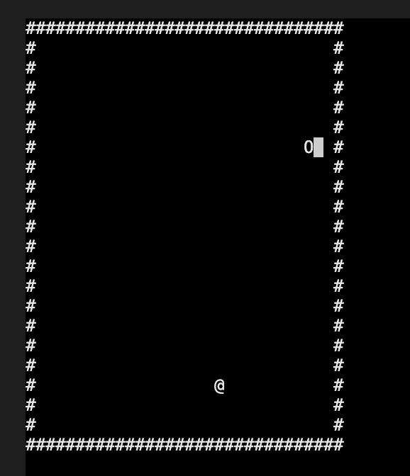
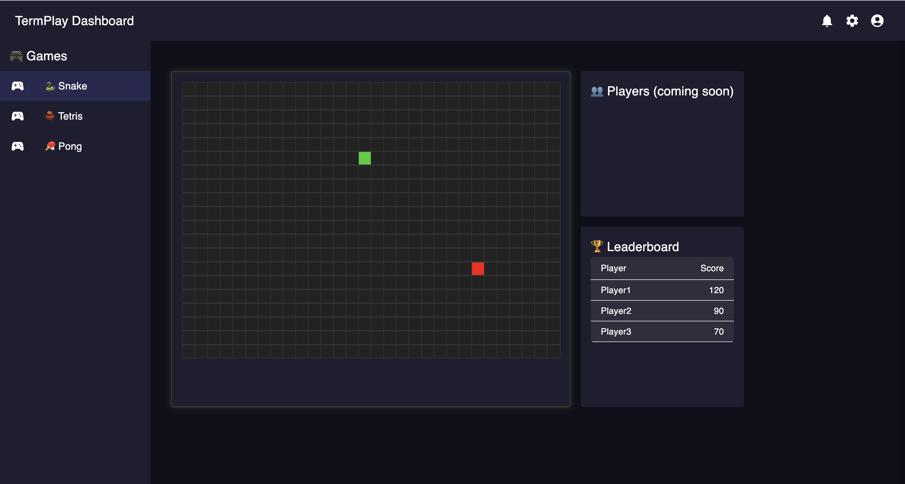

# TermPlay — Multiplayer Terminal Games Platform

**TermPlay** is a realtime multiplayer platform for classic terminal-based games — built for learning game servers, WebSockets, and live dashboards.

Players play in their terminal — spectators watch the game live on the web dashboard.


## Features

✅ Terminal-based multiplayer games  
✅ Live game state broadcast with WebSocket + Socket.IO  
✅ Live web dashboard with player list & leaderboard  
✅ Replay system for saving game states  
✅ Currently supports **Snake** — more games coming soon!


## Tech Stack

- **Server:** Node.js + WebSocket + Socket.IO
- **Client:** Python (client.py) using `websockets` + `curses` (terminal game client)
- **Dashboard:** React + Vite + Material UI + Socket.IO client
- **Game Engine:** Custom real-time game loop (`tick.js`)


## How to Run

### 1️⃣ Start Server

```bash
cd server
node server.js
```

### 2️⃣ Run Terminal Client

```bash
cd client
source venv/bin/activate
python client.py
```

### 3️⃣ Start Dashboard

```bash
cd dashboard
npm install
npm run dev
```

Open browser → [http://localhost:5173/](http://localhost:5173/)


## Current Games

- 🐍 **Snake** — multiplayer survival, eat food and compete for score!


### Snake Game in Terminal




### Snake Game in Web Dashboard





## How It Works

- Players connect with `client.py` and play using arrow keys.
- Game state is broadcast to both players and dashboard in real time.
- Dashboard shows game board + players + leaderboard.
- Game state is saved in `replay_data/` folder for replays.


## Project Structure

```
termplay/
├── client/           # Terminal client (client.py)
├── server/           # Game server (WebSocket + Socket.IO)
│   ├── rooms/        # Game room implementations (SnakeGameRoom.js)
│   ├── tick.js       # Game loop
│   └── server.js     # Server entry point
├── dashboard/        # React dashboard (Material UI + Socket.IO)
├── replay_data/      # Saved game state replays
└── README.md         # This file
```


## Roadmap

- Add more games: Tetris, Pong, Connect Four
- Player login & nicknames
- Spectator mode improvements
- Game replay viewer


## Built for Learning

TermPlay is a fun project to explore:

- Real-time multiplayer game servers
- WebSocket protocols
- Live dashboards & visualizations
- Game loops & tick-based systems


